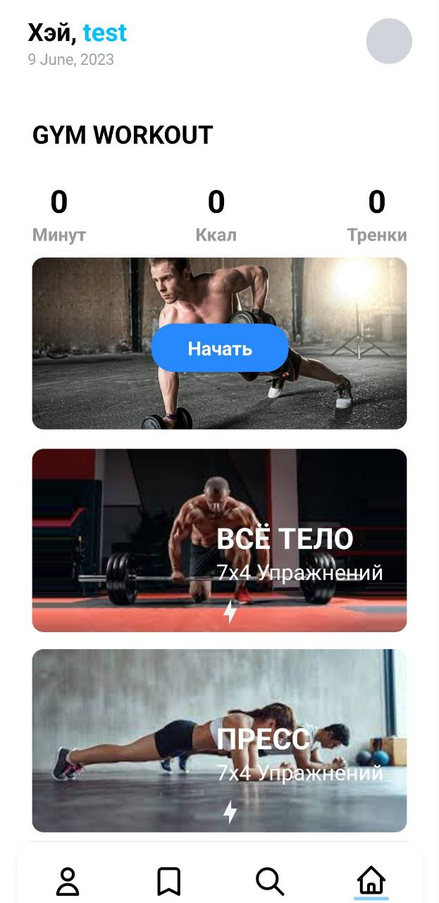

### Fitness App use ReactNative
The mobile fitness application is a cross-platform app developed for iOS and Android devices using React Native, Expo, and Firebase. The app allows users to track their fitness goals, progress, and activities, as well as access a wide range of workout routines, personalized training plans, and nutrition tips.

The app's key features include a user-friendly interface, push notifications for reminders and updates, social sharing options, and real-time analytics. Users can create their fitness profiles, set their fitness goals, and receive customized workout plans based on their preferences, fitness level, and availability.

The app integrates with Firebase for user authentication, data storage, and real-time updates. This allows users to securely access their fitness data from multiple devices, and the app to provide personalized recommendations based on their activity and progress.

# Screen:

